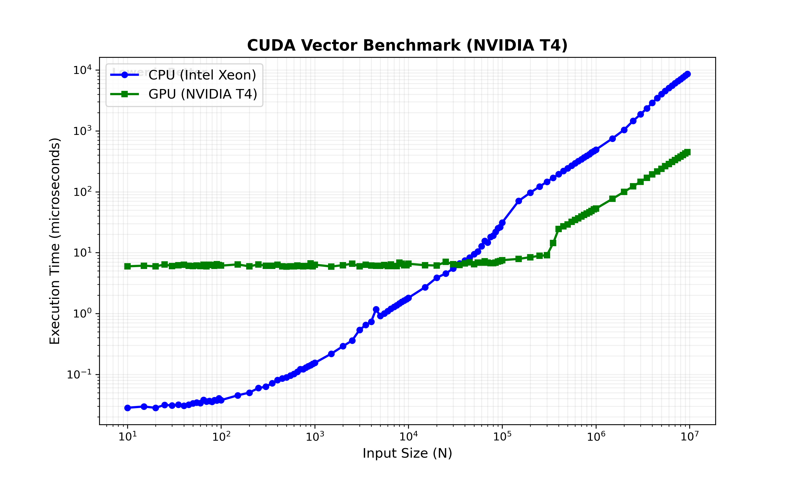

# AWS G4dn CUDA Benchmarks

[](./LICENSE)
[](https://aws.amazon.com/ec2/instance-types/g4/)
[](https://developer.nvidia.com/cuda-zone)

This repository contains C++ and CUDA scripts designed to benchmark the NVIDIA T4 GPU on AWS EC2 `g4dn` instances. The suite includes tests for memory bandwidth, compute throughput, stream overlap, precision scaling, and multi-node network latency (Soft-RoCE vs TCP).

## Files

| File | Description |
| :--- | :--- |
| `setup_cuda.sh` | Verifies the NVIDIA driver, installs the `nvidia-cuda-toolkit` (nvcc), and installs Python dependencies for plotting. |
| `cuda_benchmark.sh` | The main interface script. It compiles the standard kernels (`vector`, `matrix`) and executes the benchmark loops. |
| `bench_vector_add.cu` | CUDA kernel for Vector Addition ($C = A + B$). Measures execution time for array sizes ranging from small to large. |
| `bench_matrix_mul.cu` | CUDA kernel for Matrix Multiplication. Comparisons are run against a naive CPU implementation for validation. |
| `run_advanced.sh` | Compiles and executes the single-node micro-benchmarks (`bandwidth`, `overlap`, `fp16`). |
| `soft-roce/setup_roce.sh` | Installs RDMA drivers (`ibverbs`, `rdma-core`) and configures the Soft-RoCE (RXE) network interface. |
| `soft-roce/bench_net_gpu.cu` | Network benchmark comparing TCP sockets against RDMA Verbs (Soft-RoCE) for transferring data to GPU memory. |
| `soft-roce/compile_net.sh` | Compiles the network benchmark with `ibverbs` linking. |

## Benchmark Results

**Vector Addition Performance**
<div align="center">
  
</div>

**Matrix Multiplication Performance**
<div align="center">
  
</div>

## Micro-Benchmark Results

Sample output from `run_advanced.sh` on a `g4dn.xlarge` instance.

#### PCIe Bandwidth (Host to Device)
Comparing standard `malloc` (Pageable) against `cudaMallocHost` (Pinned/DMA) transfers.

| Transfer Size | Pageable Speed | Pinned Speed |
| :--- | :--- | :--- |
| **10 MB** | 5.68 GB/s | 6.25 GB/s |
| **100 MB** | 6.15 GB/s | 6.27 GB/s |
| **500 MB** | 6.20 GB/s | 6.27 GB/s |

#### Precision Scaling (FP32 vs FP16)
Measuring the throughput advantage of Tensor Cores using `__half` intrinsics.

| Precision | Execution Time | Speedup |
| :--- | :--- | :--- |
| **FP32** (Float) | 0.0328 s | 1.0x |
| **FP16** (Half) | 0.0180 s | **1.82x** |

#### Network Transport (Soft-RoCE vs TCP)
Comparison of transferring 100MB buffers between two `g4dn.xlarge` instances.
*Note: On instances without hardware RDMA (like g4dn), Soft-RoCE is emulated via CPU, resulting in lower throughput than native TCP.*

| Protocol | Transport Mechanism | Throughput (Approx) |
| :--- | :--- | :--- |
| **TCP** | Standard ENA TCP/IP Stack | **~0.56 GB/s** |
| **Soft-RoCE** | RXE Driver (UDP Encapsulation) | ~0.30 GB/s |

## Prerequisites

*   **Instance:** AWS EC2 `g4dn.xlarge` (or larger).
*   **AMI:** Deep Learning OSS Nvidia Driver AMI GPU PyTorch (Ubuntu 22.04 or 24.04).
*   **Drivers:** Pre-installed on the AMI (NVIDIA 535+).
*   **Network:** For RoCE tests, Security Groups must allow all traffic (or specific TCP/UDP ports) between instances.

## Installation

Run the setup script to install the compiler and plotting libraries.

```bash
chmod +x setup_cuda.sh
./setup_cuda.sh
```

## Usage

### Standard Benchmarks
Run the Vector Addition or Matrix Multiplication suites. These scripts automatically compile the binaries and generate visualization images.

```bash
# Syntax: ./cuda_benchmark.sh <type> <limit> <iterations>

# Run Vector Addition
./cuda_benchmark.sh vector 10000000 50

# Run Matrix Multiplication
./cuda_benchmark.sh matrix 2048 20
```

### Advanced Micro-Benchmarks
Run the hardware-specific diagnostic tests (Bandwidth, Overlap, FP16).

```bash
chmod +x run_advanced.sh
./run_advanced.sh
```

## Usage: Network Benchmarks

### Option A: Soft-RoCE (Cheap, Low Performance)
Works on any instance size (e.g., `g4dn.xlarge`). Good for testing code logic.

1.  **Setup (Both Nodes):** `cd soft-roce && ./setup_roce.sh && ./compile_net.sh`
2.  **Run Server:** `./bench_net server`
3.  **Run Client:** `./bench_net client <SERVER_IP>`

### Option B: AWS EFA (High Performance)
**Requirements:**
*   **Instance:** Must use `g4dn.8xlarge` or larger (smaller sizes do not support EFA).
*   **Launch Config:** You **MUST** check "Enable Elastic Fabric Adapter" in the Network Settings during launch.
*   **Placement Group:** Instances should be in a "Cluster" placement group for low latency.

**Step 1: Setup & Reboot (Both Nodes)**
The EFA driver updates the kernel. You must reboot.
```bash
cd efa_benchmark
./setup_node.sh
sudo reboot
```

**Step 2: SSH Configuration (Both Nodes)**
After reboot, login and configure passwordless SSH.
```bash
cd efa_benchmark
./configure_ssh.sh
# COPY output key from Node A -> ~/.ssh/authorized_keys on Node B
# COPY output key from Node B -> ~/.ssh/authorized_keys on Node A
# VERIFY by running: ssh <OTHER_IP> (It must not ask for a password)
```

**Step 3: Run Benchmark (Node 1)**
```bash
./run_nccl.sh <NODE_1_IP> <NODE_2_IP>
```

### Troubleshooting EFA
If the benchmark hangs or fails:
1.  **Check Firewall:** EFA uses the SRD protocol, not TCP. Ensure your Security Group Inbound Rule allows **All Traffic**.
2.  **Disable Ptrace:** Ubuntu re-enables Ptrace on reboot. Run `sudo sysctl -w kernel.yama.ptrace_scope=0`.
3.  **Test Hardware:** Run `/opt/amazon/efa/bin/fi_pingpong -p efa -e rdm`. If this hangs, it is a firewall issue.
        ```